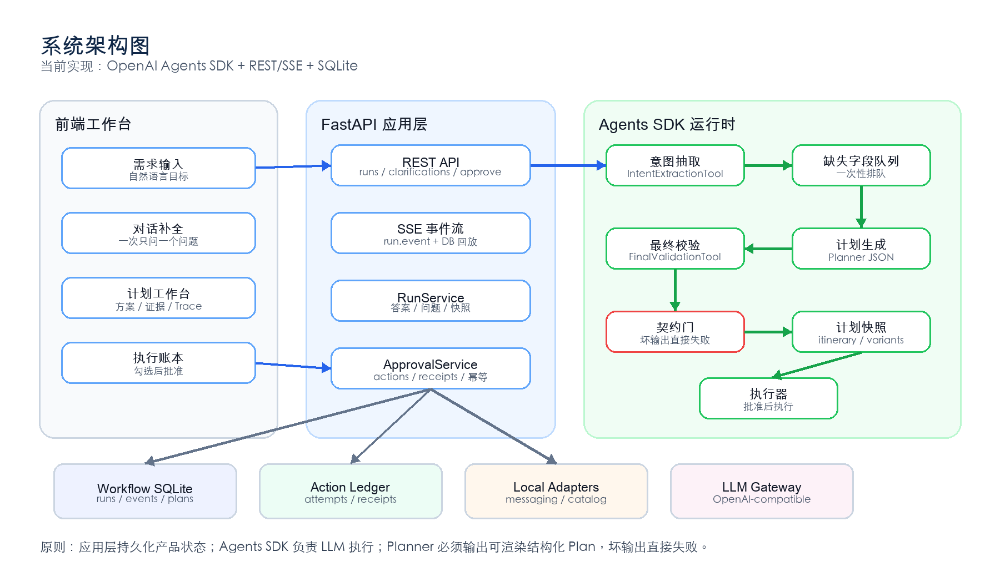
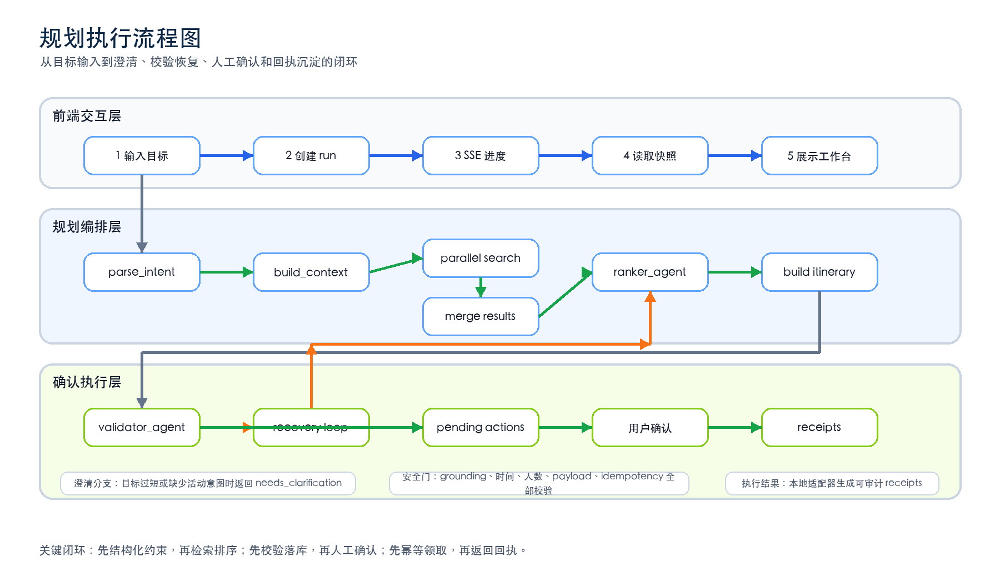

# 🚀 LocalLife-Agent (WeekendPilot) 本地生活闭环智能体助手

[](https://fastapi.tiangolo.com/)
[](https://nextjs.org/)
[](https://react.dev/)
[](https://openai.github.io/openai-agents-python/)
[](https://sqlite.org/)

> **LocalLife-Agent（又名 WeekendPilot）** 是一个面向本地生活场景的“规划到执行”闭环智能体 Demo。它将用户一句模糊的自然语言目标（如“雨天亲子半日游”、“朋友运动后聚餐”），转化为可解释的行程、可比较的候选方案、可审计的工具调用轨迹，以及**必须经用户确认后才幂等执行**的预约、领券、点单等具体动作。
>
> 💡 本项目不是一个静态推荐列表，而是一个完整的 **Agentic Workflow（智能体工作流）** 最佳实践展示。

---

## 🌟 核心产品定位与设计哲学

在真实的本地生活服务场景中，纯大模型（LLM）的开放生成往往面临**幻觉多、约束不一致、执行无回执**等稳定性瓶颈。本项目通过创新的混合架构解决这些问题：
- **混合供给模式**：采用“远程 LLM + 本地可复现种子供给库（Seed Catalog）”的架构。LLM 负责顶层意图理解与多步骤逻辑推理，本地种子数据库则模拟真实的 POI、天气、菜单、优惠券、路线及可用性，不连接真实的外部支付或生产预约系统，确保演示现场百分之百可复现与稳定。
- **规划与执行分离**：明确区分为**只读规划工具**和**有副作用执行动作**。在规划阶段，智能体仅生成待确认动作（Pending Actions），绝对不会产生实际的订座、领券或下单行为。
- **可审计与可观测**：前端提供 Evidence（推荐证据面板）和 Trace（执行链路面板），让评委和用户清晰看到“大模型为什么推荐这个”、“调用了什么工具”、“哪里进行了约束校验”。

---

## 🗺️ 系统架构设计

本项目采用前后端分离的现代化技术架构。



### 💻 前端：Next.js 15 + React 19 单页工作台
- **交互状态机**：利用定制的 `usePlanMachine` 状态钩子优雅地管理 `idle ➔ planning ➔ clarifying/results ➔ executing ➔ completed` 整个交互状态。
- **实时数据渲染**：结果页同时展示多维度时间轴、路线渲染、多候选 Variants 对比、证据链（Evidence Panel）、智能体中间状态 Trace 以及最终的待批准动作台账（Action Ledger）。
- **实时流式更新**：通过 Server-Sent Events (SSE) 技术，将后端的规划进度实时推送到前端页面，实现流畅的交互体感。

### ⚙️ 后端：FastAPI + OpenAI Agents SDK + SQLite 引擎
- **运行时管理**：FastAPI 暴露 run-centered REST API，应用服务创建 Run、持久化 Plan 与 Action Ledger，并由 OpenAI Agents SDK runtime 负责模型推理、工具调用、guardrail 与 handoff。
- **数据库设计**：利用 SQLite 存储所有 run 状态、SSE 事件、计划快照、执行回执和用户显隐式画像。

---

## 🤖 智能规划执行工作流

整个规划流水线围绕一次 `/api/runs` 创建的 Run 展开。后端应用层把自然语言目标、用户画像、本地供给、工具 schema 和审批策略组装为 OpenAI Agents SDK runtime 的上下文，并将每个关键步骤写成可回放的 `run.event` SSE 事件。



### ⚡ 核心 Pipeline 步骤解析

1. **`parse_intent`（意图解析与结构化）**
   - 远程 OpenAI 兼容模型将用户的自然语言解构成结构化的约束对象 `ParsedConstraints`（含场景、起点、时间窗、同行人偏好、硬约束等）。
   - > [!IMPORTANT]
     > 当用户意图过于模糊时（例如仅输入“随便逛逛”），系统会流式返回 `needs_clarification` 并进入澄清态，交互式收集用户偏好，决不盲目伪造计划。
2. **`build_context`（多维上下文补全）**
   - 自动获取实时天气以及 SQLite 中缓存的用户画像，作为约束背景。
3. **`parallel_search`（本地供给并行检索）**
   - 活动点（Activities）、餐厅（Restaurants）和散步点（Walks）三个节点并行检索本地 Catalog，根据天气安全性、距离半径、偏好进行硬性过滤。
4. **多智能体决策循环（Ranker ➔ Validator ➔ Recovery）**
   - 🤖 **RankerAgent**：负责分析候选 POI，基于用户偏好和时序完成多目标推荐和排序。
   - 🤖 **ValidatorAgent**：扮演“安检员”角色，强校验营业时间、餐厅容量、天气风险、路线效率和硬约束的匹配程度。
   - 🤖 **RecoveryAgent**：当校验发现阻塞性冲突时（如暴雨天推荐了户外项目），该智能体将**仅替换冲突节点**，并动态回退到 Ranker 进行二次排程。
   - > [!NOTE]
     > 智能体推理发生意外时有强规则保障 Fallback，且恢复循环最多迭代 3 次，防止死循环。最终生成 `ready`、`pending_approval` 或 `validation_failed` 状态的路线方案。

---

## 🔒 执行安全与可观测性保障

> [!WARNING]
> 为了防范 AI 智能体的“越权执行”与“重复操作”，本项目在执行侧实施了极其严苛的金融级安全隔离与幂等设计。

- **副作用动作隔离**：`reserve_activity`、`create_reservation`、`claim_coupon`、`create_order`、`send_plan_message`、`create_calendar_event` 等动作均被标记为 `side_effect=true` 和 `requires_confirmation=true`。
- **显式用户授权**：规划出的动作仅仅作为 Pending Actions 记录在 Ledger 中。只有当用户在前端工作台逐一手动勾选确认后，调用 `/api/runs/{run_id}/actions/approve` 接口，系统才会以原子化的方式执行。
- **并发与幂等控制**：后端执行利用 SQLite 的 `BEGIN IMMEDIATE` 排他锁锁库，结合唯一的 `Idempotency Key`、Action Attempts 和 Receipts 回执，杜绝用户在前端多次点击导致的多重领券或重复点单。

---

## 🛠️ 快速开始

### 📋 环境要求
* **Node.js** 18+
* **Python** 3.11+
* **uv** (极速 Python 包与依赖管理器)

### 1. 安装项目依赖

```bash
# 克隆项目后，在根目录下分别安装前端和后端依赖
# 安装前端依赖
npm install

# 安装后端依赖 (使用 uv 极大缩减安装时间)
uv sync
```

### 2. 配置环境变量

复制示例环境变量配置文件并填入您的 LLM API 配置：

```bash
# 复制环境变量模板
cp .env.example .env

# 编辑 .env 文件并填入您所用的 LLM 服务配置
# 示例配置：
# LLM_PROVIDER=openai
# LLM_BASE_URL=https://api.openai.com/v1
# LLM_API_KEY=your-api-key-here
# LLM_MODEL=gpt-4o
# LLM_REMOTE_ENABLED=true
```

### 3. 启动开发服务器

你可以利用我们集成好的并发启动脚本**一键拉起**前端与后端服务：

```bash
# 一键并发拉起前后端服务
npm run dev:full
```

或者，你也可以选择在两个不同的终端窗口中分别启动：

```bash
# 启动前端服务 (运行于 http://127.0.0.1:4174)
npm run dev

# 启动后端 FastAPI 服务 (运行于 http://127.0.0.1:8787)
npm run dev:backend
```

后端 API 的交互式 Swagger 文档会在 [http://127.0.0.1:8787/docs](http://127.0.0.1:8787/docs) 可用。

---

## 🧪 自动化测试套件

为保证 Hackathon 现场修改与演示的绝对稳定性，项目配备了极高覆盖率的前后端与契约测试网络。

```bash
# 一键运行全部测试
npm run test:all
```

### 🔬 分门别类测试命令

* **前端单元测试**：使用 TypeScript 原生测试框架快速对核心组件和状态机进行断言。
  ```bash
  npm run test:frontend
  ```
* **后端单元测试**：使用 `pytest` 覆盖核心 API、SSE 推送、OpenAI Agents SDK runtime 集成、Agent 决策算法与 Action 幂等性。
  ```bash
  npm run test:backend
  ```
* **前后端契约测试（Contract Tests）**：使用 `tsx` 运行，强校验前端 API 客户端与后端 FastAPI 数据响应字段的 100% 映射契约。
  ```bash
  npm run test:contracts
  ```
* **端到端（E2E）集成测试**：使用 Playwright 模拟用户自然语言输入、流式等待、方案修改与执行流确认。
  ```bash
  npm run test:e2e
  ```

---

## 📁 项目目录结构解析

```
├── app/                    # Next.js 15 页面布局及路由入口 (App Router)
├── components/             # 复用 React 组件库
├── features/planner/       # 规划器（Planner）核心前端状态机与 API 客户端
│   ├── usePlanMachine.ts   # 控制 idle -> planning -> clarify -> results 状态转移的核心
│   └── apiClient.ts        # 对接 SSE 与 Resume API 动作
├── lib/                    # 前端基础库与 HTTP 工具包
├── backend/                # FastAPI 后端工程
│   ├── api/                # FastAPI 路由、SSE 推送机制及 App 初始化
│   ├── application/        # Run、Approval、Plan 生命周期应用服务
│   ├── agents/             # OpenAI Agents SDK runtime 与多智能体协同实现
│   ├── llm/                # LLM 多适配器客户端封装
│   └── tools/              # 只读规划工具及有副作用 Action 工具注册表
├── tests/                  # 高度覆盖的测试层
│   ├── backend/            # 后端 pytest 逻辑测试
│   ├── frontend/           # 前端状态与渲染测试
│   ├── contracts/          # 强契约测试
│   └── e2e/                # Playwright 端到端浏览器自动化测试
└── types/                  # 共享 TypeScript 类型定义文件
```

---

## 📡 核心 API 端点与 SSE 流式说明

### 🛠️ 关键 HTTP 接口清单

| 请求方法 | 路由地址 | 功能描述 | 核心有效负载（Payload） / 返回信息 |
| :--- | :--- | :--- | :--- |
| **POST** | `/api/runs` | 发起一个新的规划 Run | 入参为用户 Prompt，返回 `run_id`、`plan_id`、`status` 与 `events_url` |
| **GET** | `/api/runs/{run_id}/events` | **SSE 流式数据传输** | 以 `run.event` 推送 `run.started`、`agent.*`、`tool.*`、`approval.required`、`run.completed` 等事件 |
| **GET** | `/api/runs/{run_id}` | 获取 Run 状态 | 返回当前 `status`、`plan_id`、当前 Agent、创建和更新时间 |
| **GET** | `/api/plans/{plan_id}` | 获取最终规划快照与路线详情 | 返回完整的时序 Itinerary、推荐证据 Evidence、中间 Trace、Action Ledger 等 |
| **POST** | `/api/runs/{run_id}/actions/approve` | 批准并执行选中的 Actions | 用于原子化确认执行 Pending Actions，返回执行回执（Receipts） |
| **POST** | `/api/runs/{run_id}/actions/reject` | 拒绝当前 Run | 记录拒绝原因并终止等待审批的 Run |
| **GET** | `/api/llm/status` | LLM 连接与心跳健康检查 | 用于演示前的网关稳定性检查 |

---

## 🛡️ 演示最佳实践与数据存储

- **多用户沙箱**：通过指定 `x-user-id` 请求头，系统可以在同一环境上轻松模拟多种不同兴趣画像（如“亲子偏好”、“高消费偏好”）的智能体交互逻辑。
- **本地 SQLite 路径**：
  - 工作流状态数据库：存储于根目录的 `.weekendpilot/workflow.sqlite`
  - 用户画像冷启动库：存储于根目录的 `.weekendpilot/profiles.sqlite`

---

## 🤝 贡献规范

1. 创建新功能分支：`git checkout -b feature/amazing-feature`
2. 提交修改：`git commit -m "feat: 描述"`
3. 推送分支并提交 PR，请确保所有测试指令（`npm run test:all`）通过后再进行 Merge。

---

*本项目专为 Hackathon 和 Agentic Workflow 设计方案展示而定制，预留了对接高德/百度地图 API、美团/大众点评商户真实供给、腾讯微信/阿里钉钉/Google 日历消息通道的完整适配器层。*
