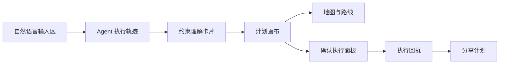
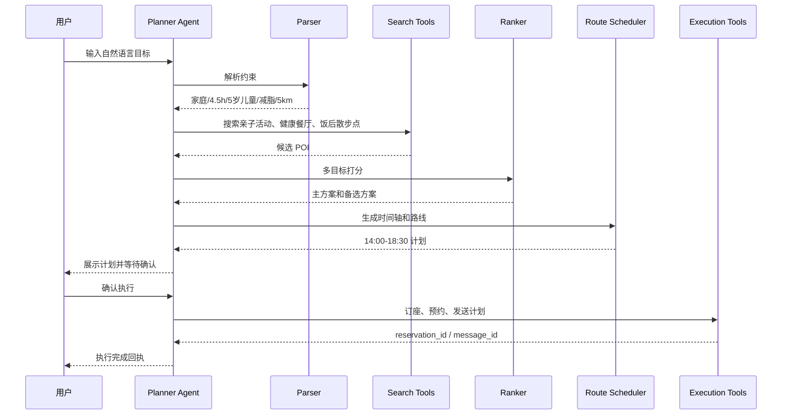
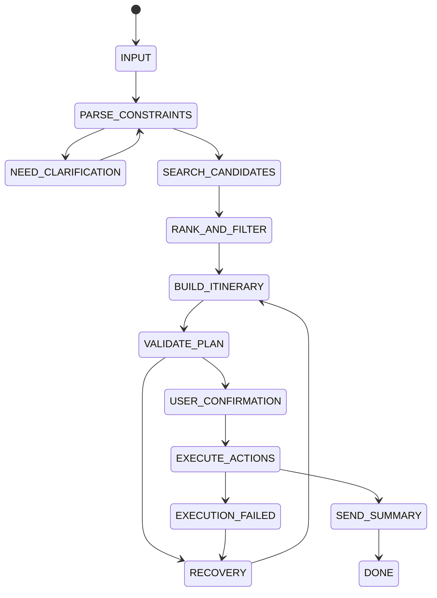
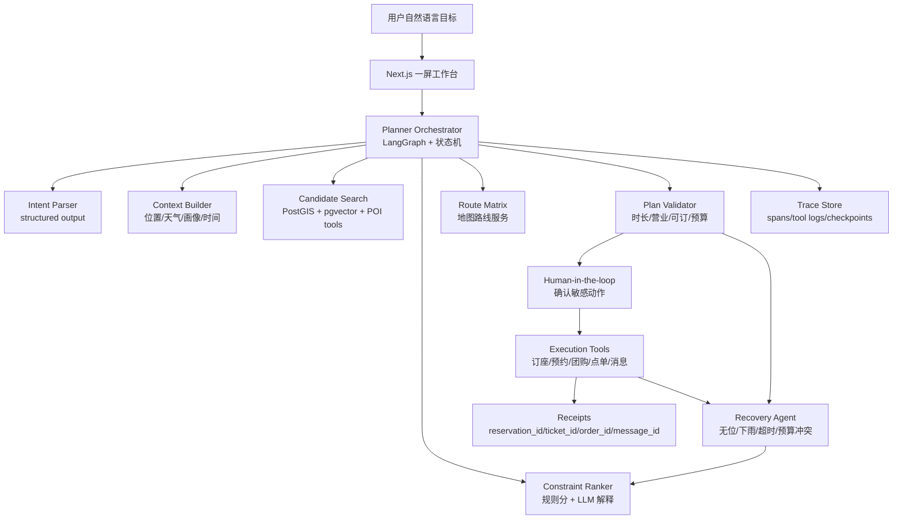

# 周末半日活动管家 Agent 详细设计文档

调研更新时间：2026-05-07  
适用场景：AI Hackathon、产品 Demo、产品设计评审、技术方案评审  
产品代号：WeekendPilot / 周末半日活动管家

## 1. 一句话结论

本产品不是“附近有什么”的搜索推荐工具，而是一个面向本地生活的执行型 Agent：用户用一句自然语言表达目标，系统理解时间、人群、偏好、预算、距离、天气、可订性等约束，生成 4 到 6 小时可执行半日方案，并在用户确认后完成订座、购票、点单、导航、发送计划等动作。

最好的作品不应该展示“AI 写了一段攻略”，而应该展示“AI 帮用户完成了一件原本要打开 5 到 8 个 App 才能完成的本地生活任务”。

## 1.1 官方评审标准对齐

本方案按美团 Hackathon 官方评审的四个维度设计：创新性、完整性、应用效果、商业价值。所有产品功能和技术实现都必须服务这四项评分。

| 官方维度 | 设计目标 | 作品中的体现 |
|---|---|---|
| 创新性 | 从“附近推荐”升级为“本地生活执行型 Agent” | 用户一句话触发计划生成、路线优化、可订性检查、订座/预约/点单/发送计划 |
| 完整性 | 做成从需求理解到执行回执的全链路系统 | 输入、约束解析、供给检索、多目标打分、时间轴、地图、确认执行、异常恢复全部闭环 |
| 应用效果 | 自然、及时、准确、可信 | 约束卡片可编辑，地点有来源和推荐理由，工具调用可见，失败可恢复 |
| 商业价值 | 为美团本地生活带来转化、复购、供给曝光和品牌心智 | 串联餐厅订座、活动预约、团购券、甜品点单、导航和分享，形成交易闭环 |

最高分表达顺序是：先证明美团为什么需要它，再证明它不是普通推荐，再证明 Agent 技术可信，最后证明现场作品稳定可运行。

## 2. 外部趋势判断

### 2.1 前沿产品趋势

| 趋势 | 代表信号 | 对本产品的启发 |
|---|---|---|
| 对话式地图成为入口 | Google Maps 在 2026 年推出 Ask Maps，让用户用复杂自然语言问地点问题，并把结果放到地图上展示。 | 首页不应是传统列表搜索，而应是“自然语言输入 + 地图化计划画布”。 |
| AI 从问答转向执行 | OpenAI Operator / ChatGPT agent 强调浏览器操作、点击、输入、滚动，并把任务做完。 | 产品必须有确认后的执行动作，而不是只生成推荐文本。 |
| 工具协议标准化 | OpenAI Responses API 支持远程 MCP、文件搜索、代码解释器、后台任务等工具能力。 | 本项目的订座、路线、天气、点单、发送消息都应抽象成工具，未来可替换真实服务。 |
| 人在环和可恢复工作流成为 Agent 标配 | LangGraph 的 durable execution 强调工作流保存、暂停、恢复，适合用户确认和长任务。 | 计划生成、用户确认、执行失败重试都应保存状态，避免 Agent 黑箱运行。 |
| 地点内容正在被 AI 摘要化 | Google Places API 提供 AI-powered place summaries，用地点 ID 汇总短摘要。 | POI 卡片应显示“为什么适合这次出行”的 AI 摘要，而非只显示评分。 |
| 协作式 itinerary 成熟 | Mindtrip、Wanderlog 都强调多人协作、地图、路线优化、行程管理。 | 朋友聚会场景要支持分享、偏好确认和可改方案。 |
| 本地生活 Agent 已经成为美团方向 | “小美”被报道为美团独立 C 端 AI Agent，可通过自然语言和内部接口实现下单、推荐等服务。 | 本赛题最强定位应是“本地生活智能体”，不是旅游规划器。 |

### 2.2 设计原则沉淀

本产品采用四条设计原则：

1. **先理解，再行动**：先把隐含约束显性化，避免直接给出幻觉方案。
2. **计划可检查**：推荐必须解释原因、取舍、风险和备选。
3. **敏感动作必确认**：订座、下单、购票、发送消息都要二次确认。
4. **失败是产品体验的一部分**：无位、下雨、超时、预算冲突时，系统要自动恢复并解释。

## 3. 产品定位

### 3.1 产品定义

周末半日活动管家是一个本地生活规划与执行 Agent，面向用户临时空出 4 到 6 小时时间、想和家人或朋友出门但不想自己反复搜索比较的场景。

### 3.2 核心价值

| 用户痛点 | 产品价值 |
|---|---|
| 不知道附近适合去哪 | 根据人群和约束生成候选活动 |
| 餐厅、活动、路线要跨 App 比较 | 聚合为一个可执行时间轴 |
| 家庭成员或朋友偏好多且冲突 | 显示约束满足度和取舍理由 |
| 计划经常因为无位、下雨、排队失败 | 内置备选方案和自动重排 |
| 最后还要订座、购票、发消息 | 用户确认后调用工具完成 |

### 3.3 不做什么

- 不做长途旅行规划。
- 不做纯内容攻略社区。
- 不做无确认支付；真实支付必须走用户确认和可信支付页，作品中以安全回执模拟交易结果。
- 不把“AI 自由发挥”作为地点来源，所有 POI 必须来自本地数据或真实 API。

## 4. 目标用户与核心场景

### 4.1 用户画像

| 用户 | 典型需求 | 关键约束 |
|---|---|---|
| 年轻家庭用户 | 周末带孩子和伴侣出门半天 | 儿童友好、距离近、餐厅健康、少排队 |
| 朋友聚会组织者 | 4 到 6 人临时约活动 | 男女混合、拍照聊天、预算适中、路线顺 |
| 情侣或约会用户 | 下午到晚上安排约会 | 氛围、排队、安静、饭前饭后衔接 |
| 懒得规划的本地用户 | 想出门但不想研究 | 少输入、少跳转、能直接执行 |

### 4.2 核心场景

作品一步到位覆盖四类高价值场景，确保创意、完整性、应用效果和商业价值同时成立：

1. 家庭半日：孩子 5 岁，伴侣减脂，下午空闲，不想离家太远。系统安排亲子活动、健康餐厅、饭后散步或低糖甜品，并完成订座和发送计划。
2. 朋友聚会：4 人，2 男 2 女，先活动再吃饭，最后逛小吃街或甜品。系统兼顾拍照、聊天、预算、路线顺路和餐厅氛围。
3. 雨天室内：户外活动因下雨不适合。系统自动切换到室内儿童乐园、展览、商场活动或手作体验，并重新计算路线和时间。
4. 交易异常：用户确认后发现餐厅无位或活动满员。系统保留可用计划节点，只替换冲突节点，展示差异后重新确认执行。

## 5. 成功标准

### 5.1 产品成功标准

| 指标 | 目标 |
|---|---|
| 从输入到生成主方案 | 10 秒内展示首个可执行方案，随后继续补全可订性和备选 |
| 方案完整度 | 包含出发、活动、餐厅、饭后安排、回程 |
| 约束识别准确率 | 核心脚本中关键约束 100% 识别 |
| 用户确认后动作完成率 | 所有执行动作 100% 有结果回执或失败恢复 |
| 异常恢复可见性 | 失败原因、备选方案、重新确认都可见 |
| 商业闭环清晰度 | 每个计划都能关联至少一个美团交易或履约动作 |

### 5.2 评委可感知亮点

- 不是列表，而是可执行时间轴。
- 不是黑箱推荐，而是有约束卡片和分数解释。
- 不是“AI 说可以订”，而是工具返回 reservation_id、ticket_id、coupon_id、message_id。
- 不是失败报错，而是失败后自动换方案。

## 6. 信息架构

产品采用一屏主工作台，而不是传统多页跳转。



### 6.1 主工作台布局

| 区域 | 位置 | 内容 | 设计目的 |
|---|---|---|---|
| 输入区 | 顶部 | 用户原话、语音入口、示例 prompt | 降低输入门槛 |
| Agent 状态轨 | 左侧 | 解析、搜索、打分、排程、检查可订性、等待确认、执行 | 让 Agent 过程可见 |
| 约束卡片 | 左侧或顶部 | 时间、人群、距离、预算、饮食、天气、交通 | 让用户确认系统理解 |
| 计划画布 | 中央 | 时间轴、主方案、备选方案、预算 | 产品核心结果 |
| 地图区 | 右侧 | 路线、距离、交通方式、周边 POI | 增强可执行性 |
| 执行区 | 底部固定 | 订座、购票、点单、发送计划 | 体现闭环 |

### 6.2 移动端布局

移动端采用三段式：

1. 顶部为输入和当前计划状态。
2. 中部为可横滑的时间轴卡片。
3. 底部为固定确认执行栏。

地图不抢主屏，默认折叠为路线摘要，点击后全屏查看。

## 7. 核心用户流程

### 7.1 家庭主流程

用户输入：

> 今天下午是空的，想和老婆孩子出去玩几个小时，别离家太远。孩子 5 岁，老婆最近在减肥，帮我安排一下。

系统流程：



### 7.2 异常恢复流程

餐厅无位时：

1. `check_availability` 返回 `available=false`。
2. Recovery Agent 保留活动和路线中已稳定的部分。
3. 重新检索同区域、同预算、同饮食约束的餐厅。
4. 展示原因：“18:00 主餐厅无位，已切换到距离活动点 600m 的备选餐厅”。
5. 用户重新确认后执行订座。

## 8. 交互设计细节

### 8.1 输入体验

输入区支持三种方式：

- 文本输入：适合 Demo 和桌面端。
- 语音输入：适合真实移动场景，尤其是临时出门。
- 示例任务按钮：家庭半日、朋友聚会、约会、雨天室内。

输入框下方不要写大段说明，只给 2 到 3 个轻量示例。产品要让用户感觉“直接说人话就可以”，而不是学习表单。

### 8.2 约束理解卡片

解析后展示结构化卡片：

| 卡片 | 示例 |
|---|---|
| 时间 | 今天 14:00 到 18:30，约 4.5 小时 |
| 人群 | 2 位成人，1 位 5 岁儿童 |
| 距离 | 默认从当前位置出发，半径 5km |
| 饮食 | 减脂友好，少油，避免高糖主餐 |
| 交通 | 步行和打车混合 |
| 天气 | 若下雨，优先室内 |

每张卡片可点击修改。比如用户点“半径 5km”，可以改成 3km、5km、10km。

### 8.3 Agent 执行轨迹

执行轨迹不是开发日志，而是用户能懂的状态：

- 正在理解你的约束
- 找适合 5 岁孩子的活动
- 筛掉距离太远和排队过长的地点
- 检查餐厅 18:00 是否可订
- 正在把路线压缩到 4.5 小时内
- 等你确认后再订座和发送计划

每一步可以展开看到工具名、输入摘要、返回结果。例如：

```json
{
  "tool": "check_availability",
  "input": {"place_id": "r_014", "time": "18:00", "party_size": 3},
  "result": {"available": true, "slot": "18:10"}
}
```

### 8.4 计划画布

计划画布是产品主视觉，不是普通聊天回答。每个时间段是一张可操作卡片：

| 时间 | 内容 | 操作 |
|---|---|---|
| 14:00 | 从家出发，打车 12 分钟 | 查看路线 |
| 14:20 | 室内亲子科学馆，适合 4 到 8 岁 | 换一个 |
| 16:10 | 步行到附近商场 | 查看地图 |
| 16:30 | 健康轻食餐厅，18:00 前可订 | 换餐厅 / 订座 |
| 17:40 | 饭后河畔散步或低糖甜品 | 点饮品 |
| 18:30 | 回家 | 分享计划 |

### 8.5 推荐解释

每个地点必须有“推荐理由”和“风险提示”。

示例：

- 推荐理由：距离亲子馆 600m，儿童座椅可用，菜单有低脂套餐，18:10 有位。
- 风险提示：周末 17:30 后排队增加，建议提前订座。
- 被筛掉原因：A 餐厅评分高但油炸菜多；B 活动适合 8 岁以上儿童；C 地点超出 5km。

### 8.6 确认执行面板

确认执行面板固定在底部，分成三类动作：

| 动作类型 | 示例 | 是否必须确认 |
|---|---|---|
| 低风险动作 | 保存计划、生成分享文案 | 可一键执行 |
| 中风险动作 | 订座、预约活动、发送给联系人 | 必须确认 |
| 高风险动作 | 支付、真实下单、涉及隐私联系人 | Demo 不做真实执行 |

确认文案要具体：

> 将为 3 人预订 18:10 的 Green Table，手机号使用尾号 2388。是否确认？

### 8.7 执行回执

执行完成后展示机器可验证的结果：

```json
{
  "reservation_id": "RES-20260507-3812",
  "restaurant": "Green Table",
  "time": "18:10",
  "party_size": 3,
  "message_id": "MSG-9128",
  "status": "confirmed"
}
```

这比“已帮你订好”更可信，也更适合评委判断闭环。

## 9. Agent 产品架构

### 9.1 架构原则

系统采用“中心编排器 + 确定性状态机 + LLM 工具调用 + 可恢复工作流”的架构，不做完全自由自治的多 Agent。原因是本地生活执行涉及订座、发送消息、购票、点单等副作用动作，必须可控、可追踪、可回放、可恢复。

### 9.2 核心模块

| 模块 | 职责 | 技术建议 |
|---|---|---|
| Planner Orchestrator | 调度状态机，决定下一步工具 | LangGraph / 自研状态机 |
| Intent Parser | 解析自然语言为结构化约束 | LLM structured output |
| Context Builder | 补全位置、天气、时间、用户偏好 | 用户画像 + 本地缓存 |
| Candidate Search | 搜索餐厅、活动、甜品、散步点 | 美团 POI schema / Google Places / 高德 / 本地种子数据 |
| Constraint Ranker | 多目标打分和过滤 | 规则分 + LLM 解释 |
| Route Scheduler | 生成路线和时间轴 | 路线矩阵 + 时间窗约束 |
| Execution Agent | 订座、预约、点单、发消息 | MCP-ready tools / transaction adapters |
| Recovery Agent | 处理无位、下雨、超时 | fallback policy |
| Trace Store | 保存每步输入输出 | SQLite / Supabase / local JSON |

### 9.3 状态机



## 10. 技术方案

### 10.1 最终技术栈

最终采用 **Next.js + React 19 + OpenAI Responses API + OpenAI Agents SDK + LangGraph durable execution + MCP-ready tools + PostgreSQL/PostGIS/pgvector + 地图路线服务 + Agent trace**。这不是低配过渡版，而是完整作品的目标架构。

| 层级 | 最终选型 | 选择理由 |
|---|---|---|
| 前端框架 | Next.js App Router + React 19 | Server Components、Server Functions、Streaming 适合构建一屏 Agent 工作台；React 19 optimistic UI 适合执行确认和局部重排。 |
| UI 系统 | shadcn/ui + Radix primitives + Tailwind CSS v4 | 快速构建高质量工具型界面；组件可控，适合沉淀为自有设计系统。 |
| 动效 | Motion for React | 用于 Agent trace、时间轴重排、失败恢复 diff、执行回执；只服务可理解性，不做炫技动画。 |
| Agent 编排 | LangGraph durable execution + TypeScript 状态机内核 | 既有确定性状态控制，又有 checkpoint、暂停恢复、失败重放，适合本地生活长链路任务。 |
| LLM 接入 | OpenAI Responses API structured output + function tools + background mode | 支持结构化输出、工具调用、后台任务和远程 MCP，适合从自然语言到执行动作的完整链路。 |
| Agent 能力 | OpenAI Agents SDK TypeScript | 使用 handoffs、guardrails、human-in-the-loop、tracing，让技术亮点在界面和日志里可见。 |
| 工具协议 | MCP-ready function tools | 餐厅、活动、地图、订单、消息、天气、日历都按 MCP schema 设计，作品中可本地运行，架构上可替换真实服务。 |
| 地图路线 | Mapbox GL JS 视觉层 + 高德/Google Routes 兼容接口 | 视觉上有真实地图体验，逻辑上支持路线矩阵、交通方式、实时 ETA。 |
| POI 与检索 | PostgreSQL + PostGIS + pgvector + 业务规则打分 | 同时支持地理过滤、营业时间、可订性、价格、标签、语义检索，比纯向量库更适合本地生活。 |
| 数据缓存 | Redis / 本地缓存层 | 缓存天气、路线矩阵、POI 查询、热门商圈，降低延迟。 |
| 后端服务 | Next.js Route Handlers + Agent worker | UI 请求和长任务执行解耦；副作用动作放在 worker 中，避免重复执行。 |
| 可观测性 | OpenAI Agents tracing + OpenTelemetry + 前端 trace 面板 | 评委能看见每一步工具调用，工程上能审计、回放、定位失败。 |
| 浏览器执行 | Browserbase Stagehand / Playwright fallback | 真实商家没有 API 时兜底执行网页订座；不是主路径，但作为商业落地能力展示。 |

### 10.2 最终架构



### 10.3 技术亮点与评分映射

| 能力 | 用在哪里 | 设计取舍 |
|---|---|---|
| Structured output | 解析用户约束、生成 itinerary JSON | 命中应用效果：准确、稳定、可编辑 |
| 工具调用 | 搜索、查可订、排路线、订座、发消息 | 命中完整性：证明不是纯聊天 |
| MCP-ready tools | 餐厅、地图、消息、订单、天气工具 | 命中商业价值：可替换成美团真实业务接口 |
| Human-in-the-loop | 订座、购票、点单、发送消息前暂停确认 | 命中应用效果和安全可信 |
| Guardrails | 阻止无确认订座、虚构地点、隐私泄露 | 命中完整性和技术成熟度 |
| Durable execution | 用户暂停确认、失败恢复、长任务继续 | 命中完整性：避免重复订座，支持恢复 |
| 地理 RAG | 检索 POI、评论、菜单、标签 | 命中应用效果：地点真实、推荐有据 |
| Route Matrix | 多 POI 顺路性计算 | 命中应用效果：路线可执行 |
| Recovery Agent | 无位、下雨、超时、预算冲突 | 命中创新性：把失败恢复作为核心体验 |
| Browser fallback | 无 API 的订座页面 | 命中商业价值：提升真实世界覆盖面 |
| Trace grading | 对工具调用、计划质量、约束满足度打分 | 命中技术成熟度：可评估、可优化 |

### 10.4 不采用纯自治多 Agent 的原因

作品会展示多个专门能力节点，但底层不让多个 Agent 自由讨论后随意执行。原因是本地生活任务存在订座、购票、发送消息、下单等副作用动作，必须可控、可解释、可确认、可回放。

正确做法是：**中心编排器 + 专门能力节点 + 工具权限 + 用户确认 + checkpoint**。这样既有 Agent 技术深度，又不会牺牲完整性和应用效果。

### 10.5 为什么不用纯聊天 UI

纯聊天 UI 的问题：

- 用户难以比较路线、时间和备选。
- Agent 执行动作不透明。
- 修改计划需要反复对话。
- 评委看不到工具调用链。

本产品采用“聊天输入 + 计划画布 + 地图 + 执行面板”的混合界面。聊天只负责输入目标和局部修改，计划画布负责承载结果。

## 11. 数据结构设计

### 11.1 ParsedConstraints

```json
{
  "scenario": "family",
  "origin": {
    "type": "current_location",
    "label": "home",
    "lat": 38.2601,
    "lng": 140.8824
  },
  "time_window": {
    "date": "2026-05-09",
    "start": "14:00",
    "duration_hours": 4.5,
    "flexible": true
  },
  "people": {
    "adults": 2,
    "children": [{"age": 5}],
    "relationship": "family"
  },
  "preferences": {
    "distance": "nearby",
    "diet": ["low_fat", "low_sugar"],
    "activity": ["child_friendly", "not_too_tiring"],
    "budget_level": "medium"
  },
  "constraints": {
    "radius_km": 5,
    "max_wait_minutes": 15,
    "avoid": ["heavy_oil", "long_queue", "smoking"]
  },
  "required_actions": [
    "activity_reservation",
    "restaurant_reservation",
    "send_plan_message"
  ]
}
```

### 11.2 POI

```json
{
  "id": "r_014",
  "name": "Green Table",
  "category": "restaurant",
  "lat": 38.2618,
  "lng": 140.8791,
  "distance_km": 2.4,
  "open_hours": [{"day": "sat", "start": "11:00", "end": "21:00"}],
  "rating": 4.6,
  "review_count": 1260,
  "avg_price": 1800,
  "tags": ["healthy", "child_seat", "low_fat", "quiet"],
  "wait_minutes": 8,
  "booking_supported": true,
  "availability": [
    {"time": "18:00", "available": false},
    {"time": "18:10", "available": true}
  ],
  "source": "mock_poi_db"
}
```

### 11.3 Itinerary

```json
{
  "id": "plan_20260507_001",
  "summary": "亲子科学馆 + 健康轻食 + 河畔散步",
  "score": 91,
  "estimated_budget": 7200,
  "total_travel_minutes": 34,
  "constraint_fit": {
    "distance": 0.95,
    "child_friendly": 1,
    "diet": 0.9,
    "time": 0.92,
    "budget": 0.86
  },
  "steps": [
    {
      "start": "14:00",
      "end": "14:15",
      "type": "transport",
      "title": "从家出发",
      "mode": "taxi",
      "travel_minutes": 15
    },
    {
      "start": "14:20",
      "end": "16:00",
      "type": "activity",
      "place_id": "a_021",
      "title": "亲子科学馆",
      "reason": "适合 4 到 8 岁儿童，室内，距离近"
    }
  ],
  "actions": [
    {
      "type": "reservation",
      "place_id": "r_014",
      "time": "18:10",
      "requires_confirmation": true
    }
  ]
}
```

## 12. 打分与排序逻辑

### 12.1 候选过滤

硬过滤：

- 不在营业时间内。
- 超出最大半径。
- 活动年龄不适配。
- 餐厅不支持当前人数。
- 预计排队时间超过阈值。

软打分：

```text
score =
  0.22 * distance_score +
  0.18 * rating_score +
  0.16 * constraint_fit_score +
  0.14 * availability_score +
  0.12 * route_efficiency_score +
  0.10 * budget_score +
  0.08 * novelty_or_vibe_score
```

### 12.2 解释生成

推荐解释不能由模型凭空写，必须基于打分因子生成：

```json
{
  "top_reasons": [
    "距离上一站步行 8 分钟",
    "有儿童座椅和低脂套餐",
    "18:10 可订，预计等待 0 分钟"
  ],
  "tradeoffs": [
    "价格略高于中等预算，但节省 20 分钟交通时间"
  ]
}
```

## 13. 工具与业务适配器

### 13.1 工具列表

| 工具 | 输入 | 输出 | 是否有副作用 |
|---|---|---|---|
| `parse_user_goal` | text, current_time | ParsedConstraints | 否 |
| `get_weather` | location, time | weather | 否 |
| `search_places` | category, constraints | POI[] | 否 |
| `search_restaurants` | cuisine, diet, party_size | POI[] | 否 |
| `check_availability` | place_id, time, party_size | availability | 否 |
| `optimize_route` | origin, waypoints | route | 否 |
| `build_itinerary` | candidates, constraints | itinerary | 否 |
| `validate_plan` | itinerary, constraints | validation_report | 否 |
| `compare_alternatives` | itinerary_a, itinerary_b | diff_report | 否 |
| `reserve_activity` | place_id, time, people | ticket_id | 是 |
| `create_reservation` | place_id, time, people | reservation_id | 是 |
| `claim_coupon` | deal_id, user_id | coupon_id | 是 |
| `create_order` | shop_id, items, pickup_time | order_id | 是 |
| `send_plan_message` | recipient, message | message_id | 是 |
| `create_calendar_event` | itinerary, participants | event_id | 是 |

### 13.2 工具调用安全规则

- `create_reservation` 必须有用户确认。
- `reserve_activity` 必须有用户确认。
- `claim_coupon` 必须展示价格、有效期、退款规则。
- `create_order` 必须有用户确认。
- `send_plan_message` 必须展示发送对象和消息内容。
- `create_calendar_event` 必须展示参与人和时间。
- 工具返回失败时不得假装成功。
- 工具成功后必须展示 ID 和状态。

### 13.3 本地实现与真实接口

所有工具都按 MCP-ready schema 设计。作品运行时可以使用本地种子数据和本地适配器保证稳定；接入真实业务时，只替换工具实现，不改 Agent 状态机和 UI。

| 工具类型 | 本地作品实现 | 真实业务实现 |
|---|---|---|
| POI 检索 | 种子 POI + PostGIS 查询 | 美团 POI、评价、榜单、商圈数据 |
| 可订性 | 本地 availability 表 | 商家排队、订座、门票余量接口 |
| 路线 | 本地路线矩阵 / 高德样例数据 | 高德、腾讯地图、Google Routes |
| 团购券 | 本地 coupon 表 | 美团团购、套餐、优惠券接口 |
| 点单 | 本地 order adapter | 外卖、到店点餐、甜品饮品订单 |
| 消息 | 本地 message receipt | 微信/短信/站内消息/日历邀请 |

## 14. 异常与恢复策略

| 异常 | 触发条件 | 系统动作 | 用户体验 |
|---|---|---|---|
| 餐厅无位 | `available=false` | 换同区域备选餐厅 | 展示原因和差异 |
| 活动满员 | ticket unavailable | 换同类型或缩短活动 | 保留餐厅不变 |
| 天气下雨 | weather=rain | 户外换室内 | 标记“雨天方案” |
| 路线超时 | total duration > 6h | 删除低优先级点 | 展示被删原因 |
| 预算超限 | budget > target | 换餐厅或活动 | 给出省钱版 |
| 约束冲突 | 如减脂 + 小吃街 | 显示取舍 | 提供健康版和放松版 |
| 工具失败 | API timeout | 重试一次后 fallback | 展示重试记录 |

## 15. 隐私、安全与信任

### 15.1 隐私最小化

只在当前任务中使用：

- 当前位置或家庭位置。
- 联系人昵称。
- 饮食偏好。
- 儿童年龄段。

不在 Demo 中保存：

- 真实手机号。
- 支付信息。
- 精确家庭住址。
- 未确认的联系人消息。

### 15.2 信任设计

| 风险 | 设计 |
|---|---|
| AI 幻觉地点 | 所有地点展示 `place_id` 和来源 |
| AI 擅自执行 | 副作用动作必须确认 |
| 用户不知道为什么推荐 | 展示分数、原因、被筛掉项 |
| 用户不同意约束 | 约束卡片可编辑 |
| 计划不可执行 | 时间、营业、路线、可订性校验 |

## 16. Demo 设计

### 16.1 三幕式演示主线

第一幕：一句话到完整计划。

1. 输入家庭场景自然语言。
2. Agent 状态轨逐步运行：解析、补全、搜索、打分、路线、可订性、计划校验。
3. 展示约束卡片：人群、孩子、饮食、时间、距离、预算、天气、交通。
4. 展示时间轴、地图路线、主方案、备选方案、推荐理由和被筛掉原因。

第二幕：计划到执行。

1. 用户点击确认执行。
2. 系统暂停并展示将执行的动作：订座、活动预约、领取团购券、点低糖饮品、发送计划。
3. 用户确认后调用执行工具。
4. 返回 `reservation_id`、`ticket_id`、`coupon_id`、`order_id`、`message_id`。

第三幕：失败恢复。

1. 切换异常脚本，触发餐厅 18:00 无位或户外活动下雨。
2. Recovery Agent 保留可用节点，只替换冲突节点。
3. 展示替换前后 diff：预算变化、路线变化、时间变化、推荐理由变化。
4. 用户重新确认后执行替代方案。

### 16.2 现场讲解词

> 我们做的不是一个推荐列表，而是一个本地生活执行型 Agent。它先把用户一句话里的隐含约束解析出来，然后搜索候选地点、检查营业和可订性、生成可执行时间轴。用户确认后，它会调用业务工具完成订座、预约、领取团购券、点单和发送计划。如果餐厅无位或天气变化，它不会报错，而是保留可用部分并自动替换冲突节点。

### 16.3 评委最容易记住的画面

- 左侧 Agent trace 在跑。
- 中间是一条下午 4.5 小时时间轴。
- 右侧是地图路线。
- 底部点击“确认执行”。
- 弹出真实样式的 `reservation_id`、`ticket_id`、`coupon_id`、`order_id` 和 `message_id`。

### 16.4 四项评分展示点

| 官方维度 | 演示时必须出现的画面 |
|---|---|
| 创新性 | 失败恢复、反向解释、从推荐到执行闭环 |
| 完整性 | 状态轨完整跑完，工具回执完整返回 |
| 应用效果 | 约束卡片、响应流式更新、地点来源、推荐理由 |
| 商业价值 | 订座、团购券、活动预约、点单、导航、分享 |

## 17. 一步到位功能范围

### 17.1 用户能力

- 一句话输入家庭、朋友、约会、雨天室内等复杂目标。
- 自动解析时间、人群、预算、距离、饮食、天气、交通等约束。
- 可编辑约束卡片，改动后局部重排计划。
- 查看主方案、备选方案、省钱版、舒适版、孩子优先版。
- 查看时间轴、地图路线、预算、行程耗时和推荐理由。
- 确认后完成订座、预约、领取团购券、点单、发送计划、创建日历。
- 失败时查看原因、替代方案和差异，并重新确认。

### 17.2 Agent 能力

- Structured output 解析用户目标。
- Context Builder 补全位置、天气、用户画像和历史偏好。
- Candidate Search 检索餐厅、活动、甜品、散步点、团购券。
- Constraint Ranker 多目标打分。
- Route Scheduler 生成 4 到 6 小时时间轴。
- Plan Validator 校验营业时间、路线、预算、可订性。
- Human-in-the-loop 管理敏感动作确认。
- Execution Agent 调用业务工具并返回回执。
- Recovery Agent 处理无位、下雨、满员、超时、预算冲突。
- Trace Store 记录每一步输入、输出、耗时、状态和错误。

### 17.3 数据能力

- 至少 80 到 120 条高质量本地 POI 种子数据，覆盖餐厅、亲子、展览、citywalk、甜品、商场、室内活动。
- 每个 POI 包含评分、评论数、价格、营业时间、标签、地理坐标、排队时间、可订性、适合人群、风险提示。
- 至少 20 条团购券或套餐数据，体现美团商业闭环。
- 至少 4 套异常数据：餐厅无位、活动满员、雨天、路线超时。
- 所有地点必须有 `place_id` 和 `source`，禁止模型编造地点。

## 18. 交付里程碑

| 时间 | 交付 |
|---|---|
| 第 0.5 天 | 完成最终信息架构、视觉草图、工具 schema、评分对齐清单 |
| 第 1 天 | 完成 POI/团购/可订性/天气/路线种子数据和数据校验脚本 |
| 第 2 天 | 完成 Agent 状态机、LangGraph checkpoint、核心工具调用、trace store |
| 第 3 天 | 完成一屏工作台：输入、约束卡片、Agent trace、时间轴、地图、确认执行 |
| 第 4 天 | 完成执行工具、回执、失败恢复、方案 diff、四类核心场景 |
| 第 5 天 | 完成视觉 polish、性能优化、演示脚本、兜底数据、评审讲稿 |

## 19. 已确定决策

1. 作品采用桌面评审大屏优先，同时保证移动端响应式布局。
2. 城市数据选择一个固定区域，使用高质量种子数据模拟美团真实供给密度。
3. 地图使用可视化底图和路线矩阵，真实 API 不作为作品稳定性的唯一依赖。
4. 支付不做无确认真实扣款，只展示团购券、订单和订座回执。
5. 评审讲解严格按“商业价值 → 产品创新 → 技术闭环 → 稳定性”顺序展开。

## 20. 参考资料

- Google Maps：Ask Maps and Immersive Navigation。https://blog.google/products-and-platforms/products/maps/ask-maps-immersive-navigation/
- OpenAI：Introducing Operator。https://openai.com/index/introducing-operator/
- OpenAI：New tools and features in the Responses API。https://openai.com/index/new-tools-and-features-in-the-responses-api/
- OpenAI Agents SDK：Handoffs。https://openai.github.io/openai-agents-js/guides/handoffs/
- OpenAI Agents SDK：Guardrails。https://openai.github.io/openai-agents-js/guides/guardrails/
- OpenAI Agents SDK：Human-in-the-loop。https://openai.github.io/openai-agents-js/guides/human-in-the-loop/
- OpenAI Agents SDK：Tracing。https://openai.github.io/openai-agents-js/guides/tracing/
- LangGraph：Durable execution。https://docs.langchain.com/oss/javascript/langgraph/durable-execution
- Google Places API：AI-powered place summaries。https://developers.google.com/maps/documentation/places/web-service/place-summaries
- Mindtrip：AI-powered travel planning。https://mindtrip.ai/
- Wanderlog：Travel planner and route optimization。https://wanderlog.com/
- OpenTable：OpenAI Operator research preview。https://www.opentable.com/restaurant-solutions/resources/openai/
- Microsoft Research：Guidelines for Human-AI Interaction。https://www.microsoft.com/en-us/research/publication/guidelines-for-human-ai-interaction/
- 科技日报：美团首款 AI Agent 产品“小美”公测。https://www.stdaily.com/web/gdxw/2025-09/12/content_399908.html
- 美团技术团队：LongCat-Flash-Chat。https://tech.meituan.com/2025/09/01/longcat-flash-chat.html
- 美团技术团队：LongCat-Flash-Thinking-2601。https://tech.meituan.com/2026/02/02/longcat-flash-thinking-2601-techreport.html
