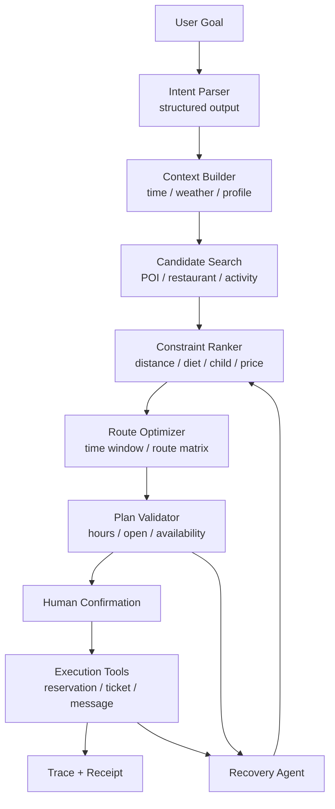

# 美团 Hackathon 高分策略：周末半日活动管家 Agent

调研时间：2026-05-07  
目标：在创意、技术、业务贴合、Demo 表达四个维度同时拿高分

## 1. 结论

这个题目想拿高分，不能只做“AI 推荐周末活动”，也不能只堆“多 Agent / MCP / RAG”等技术词。最优解是做一个 **美团本地生活交易闭环 Agent**：

> 用户一句话提出周末半日目标，Agent 解析复杂约束，调用 POI、路线、可订性、天气、订单、消息等工具，生成可执行时间轴；用户确认后完成 Mock 订座、预约、点单、发送计划；失败时自动换方案并解释。

高分的核心不是“生成得像攻略”，而是让评委看到：

1. **业务上像美团**：连接吃、玩、行、订、发消息，贴近“小美”的本地生活 Agent 方向。
2. **技术上像 Agent**：有状态、有工具、有 guardrails、有 human-in-the-loop、有 trace、有失败恢复。
3. **体验上不像聊天机器人**：不是一段文本，而是一张可编辑、可执行、可确认的本地生活计划画布。
4. **Demo 上稳**：主流程全部 Mock 可控，真实 API 作为加分项，不作为主链路依赖。

## 1.1 官方评审标准拆解

根据题目截图，评审明确从 **创新性、完整性、应用效果、商业价值** 四个维度打分。我们的方案必须逐项命中，而不是只在某一项突出。

| 官方维度 | 评审关注点 | 高分打法 | Demo 必须让评委看到 |
|---|---|---|---|
| 创新性 | 切入角度是否新颖，是否提出突破性思路，是否创造性结合 AI 和命题需求 | 不做“附近推荐”，而做“本地生活执行型 Agent”；把周末闲时活动拆成可执行任务链 | 从一句话到计划，再到订座/预约/发送计划的闭环 |
| 完整性 | 方案完整度、业务集成度、功能逻辑、用户体验、技术成熟度、稳定性 | 一屏工作台 + 状态机 + 工具调用 + Mock API；覆盖家庭/朋友/异常恢复 | 输入、解析、检索、打分、路线、确认、执行、回执、失败恢复全链路 |
| 应用效果 | 交互自然度、响应及时性、准确性，是否结合真实数据训练和优化 | 自然语言输入 + 约束卡片可编辑；用 Mock 美团 POI、评价、排队、可订性数据支撑结果 | 推荐理由、被筛掉原因、place_id/source、响应耗时、准确约束匹配 |
| 商业价值 | 市场潜力、品牌影响、用户忠诚度、经济效益、竞争优势、长期价值 | 连接美团吃喝玩乐行交易场景，提高转化、客单、复购和供给曝光 | 订座、团购、门票、甜品点单、导航、分享带来的商业闭环 |

最高分方案的表达顺序应该是：

```text
先讲业务价值：美团为什么需要它
再讲产品创新：为什么不是普通推荐
再讲技术闭环：Agent 如何可信执行
最后讲 Demo 稳定性：为什么现场一定跑得通
```

## 1.2 四项评分的优先级策略

如果时间有限，优先级应按下面排序：

| 优先级 | 要先保证什么 | 原因 |
|---|---|---|
| 1 | 完整性 | 评委最容易直接感知：能不能从输入跑到执行结果 |
| 2 | 应用效果 | 决定 Demo 是否像真实产品，而不是技术玩具 |
| 3 | 创新性 | 通过“执行型 Agent + 失败恢复”体现，不靠概念堆砌 |
| 4 | 商业价值 | 需要在讲解和页面上明确美团交易闭环，否则容易被忽略 |

一个反直觉判断：**完整性比炫技更重要**。如果多 Agent、真实地图、真实网页自动化导致主流程不稳定，会同时扣完整性和应用效果。P0 应优先用 Mock 工具保证闭环，再把技术先进性体现在 schema、trace、guardrails、human-in-the-loop 和恢复机制上。

## 2. 从公开信息反推美团关注点

### 2.1 美团“小美”的信号

公开报道显示，美团“小美”定位为“小而美的 AI 生活小秘书”，通过自然语言交互和内部接口调用，提供外卖下单、餐厅推荐、订座导航等本地生活服务。报道还强调它不是简单 AI 功能，而是独立 C 端智能体，目标是服务“人”的生活场景。

对本项目的启发：

- 产品不能停在推荐列表，必须展示从需求到交易/执行的链路。
- Demo 要体现“内部接口调用”的感觉，即使是 Mock，也要像真实工具。
- 场景要覆盖家庭、朋友、老人/孩子等真实本地生活人群。
- 最好做“主动安排”和“用户确认后执行”，而不是只回答。

### 2.2 LongCat 的技术信号

美团技术团队公开介绍 LongCat-Flash-Chat 采用 MoE 架构，总参数 560B，每 token 激活约 18.6B 到 31.3B，强调推理效率和复杂 Agent 任务能力。2026 年 LongCat-Flash-Thinking-2601 又强调多步规划、复杂交互、环境扩展、多环境 RL、抗噪训练和智能体落地能力。

对本项目的启发：

- 技术叙事要强调“复杂多步交互任务”，而不是“单轮生成”。
- 可以在方案中把模型层设计为“快模型 + 思考模型”两档：普通解析用快模型，复杂冲突/恢复用思考模型。
- 美团语境下，“高效推理 + 长链路 Agent”比“无限上下文聊天”更贴题。

## 3. 评分维度推导

没有找到本题公开官方评分细则。参考多个 AI Hackathon 公开评分标准，常见维度高度一致：

| 评分维度 | 常见关注点 | 本项目对应打法 |
|---|---|---|
| 创新性 | 是否有新意，是否不是普通包装 | 从“推荐”升级为“本地生活执行 Agent” |
| 业务价值 | 是否解决真实痛点，影响面多大 | 周末临时出门是高频、复杂、多人约束场景 |
| 技术实现 | 架构难度、AI 使用质量、代码完成度 | 状态机 + 工具调用 + 约束求解 + trace + guardrails |
| 自动化程度 | Agent 是否真的完成任务 | 用户确认后 Mock 订座、预约、发送计划 |
| 输出质量 | 准确性、可解释性、专业度 | 分数、理由、被筛掉项、风险提示 |
| 用户体验 | 是否直观易用 | 输入一句话 + 计划画布 + 地图 + 确认执行 |
| 可行性 | 是否能真实落地 | P0 Mock，P1 接高德/美团接口，P2 接交易系统 |
| 展示表达 | Demo 是否清晰、有记忆点 | 三幕式演示：生成、执行、失败恢复 |

## 4. 高分产品策略

### 4.1 不要做“周末推荐器”

普通方案：

```text
输入：我周末想出去玩
输出：推荐几个景点和餐厅
```

这个方案创意和技术都不够。评委会觉得它只是 LLM + 搜索。

高分方案：

```text
输入：今天下午想和老婆孩子出去玩几个小时，孩子 5 岁，老婆减肥，别太远
Agent：
1. 解析家庭、时间、距离、孩子、饮食约束
2. 查亲子活动、健康餐厅、饭后散步点
3. 检查营业时间、排队、可订性、路线
4. 生成 4.5 小时时间轴
5. 用户确认
6. Mock 订座、预约、发送给老婆
7. 如果餐厅无位，自动换备选
```

这才是“把事情做完”。

### 4.2 把美团优势放进 Demo

即使没有真实美团接口，也要把美团的数据资产和业务能力表现出来：

| 美团能力 | Demo 表现 |
|---|---|
| 真实评价 | POI 卡片展示评价摘要、亲子/减脂标签来源 |
| 交易数据 | 展示“周末该时段排队风险”“近期热度” |
| 商家供给 | 餐厅、活动、甜品、团购、预约多个品类 |
| 履约能力 | 订座、购票、点单、导航、发送计划 |
| 个性化 | 记住用户家庭结构、饮食偏好、出行半径 |
| 本地实时性 | 天气、营业、余位、排队、路线时间 |

## 5. 高分技术策略

### 5.1 技术亮点必须让评委看得见

技术不要只写在 PPT 里，要出现在界面上：

| 技术点 | 界面展示方式 |
|---|---|
| Structured output | 展示解析后的约束 JSON / 卡片 |
| Tool calling | 左侧 Agent trace 显示工具名和结果 |
| Guardrails | 执行动作前显示“需要用户确认” |
| Human-in-the-loop | 订座/发送消息暂停等待确认 |
| RAG / 地理检索 | 显示地点来源、place_id、标签来源 |
| Route optimization | 显示路线时间、被排除的远距离点 |
| Failure recovery | 餐厅无位后自动替换，展示 diff |
| Observability | 展示 trace_id、reservation_id、message_id |

### 5.2 推荐架构



### 5.3 P0 不要真多 Agent，做“可解释状态机”

P0 最稳做法：

- 用 TypeScript 写确定性状态机。
- 每个节点调用一个工具函数。
- 每一步都记录输入、输出、耗时、状态。
- LLM 只负责解析、解释和生成文案，不负责随意决定所有业务逻辑。

这样技术上更可靠，也更容易展示。

P1 再升级：

- OpenAI Agents SDK：handoffs、guardrails、tracing、human-in-the-loop。
- LangGraph：durable execution、checkpoint、暂停恢复、失败重放。
- MCP：把地图、餐厅、订单、消息工具服务化。

### 5.4 技术加分项优先级

| 优先级 | 技术加分项 | 为什么加分 |
|---|---|---|
| 必做 | 工具调用 trace | 证明不是普通聊天 |
| 必做 | 用户确认后执行 | 贴合执行型 Agent |
| 必做 | 失败恢复 | Hackathon Demo 记忆点强 |
| 必做 | 约束打分解释 | 证明推荐不是拍脑袋 |
| 高优先 | 地图路线画布 | 本地生活场景直观 |
| 高优先 | Guardrails | 体现真实产品安全意识 |
| 高优先 | place_id / source | 防止地点幻觉 |
| 中优先 | 可编辑约束卡片 | UX 加分 |
| 中优先 | 多模型路由 | 技术叙事加分 |
| 中优先 | MCP-ready schema | 架构扩展性加分 |
| 低优先 | 真实支付 | 风险高，不建议 |
| 低优先 | 全自动网页订座 | 不稳定，不建议主链路 |

## 6. 高分交互策略

### 6.1 一屏工作台

界面必须避免普通聊天窗口。推荐一屏五区：

1. 顶部：自然语言输入。
2. 左侧：Agent 执行轨迹。
3. 中间：半日计划时间轴。
4. 右侧：地图路线和 POI 分布。
5. 底部：确认执行栏和执行回执。

### 6.2 评委最容易记住的交互

#### 交互 1：约束被理解

用户输入后，约束卡片依次亮起：

- 家庭出行
- 2 成人 + 5 岁儿童
- 下午 4.5 小时
- 半径 5km
- 减脂友好餐厅
- 避免长排队

#### 交互 2：推荐有取舍

展示主方案旁边的解释：

```text
为什么选它：
- 亲子活动适合 4-8 岁
- 餐厅有低脂套餐和儿童座椅
- 两点之间步行 8 分钟
- 18:10 可订

为什么没选另一个：
- 评分更高，但排队 40 分钟
- 适合 8 岁以上儿童
- 超出 5km 半径
```

#### 交互 3：确认后执行

点击“确认执行”后，底部出现：

```json
{
  "reservation_id": "RES-3812",
  "ticket_id": "TKT-2041",
  "message_id": "MSG-9128",
  "status": "confirmed"
}
```

#### 交互 4：失败恢复

故意触发餐厅无位：

```text
Green Table 18:00 无位
已保留亲子科学馆和饭后散步
替换为 600m 外的 Light Bowl，18:10 可订
预算 +300 日元，路线 +4 分钟
```

这个画面比“生成一个完美计划”更像真实 Agent。

## 7. Demo 三幕式脚本

### 第一幕：一句话到计划

目标：证明产品有创意、有体验。

输入：

> 今天下午想和老婆孩子出去玩几个小时，别离家太远。孩子 5 岁，老婆最近在减肥，帮我安排一下。

展示：

- 约束卡片。
- Agent trace。
- 时间轴。
- 地图路线。
- 推荐理由。

### 第二幕：计划到执行

目标：证明不是搜索推荐，而是执行型 Agent。

操作：

- 点击确认执行。
- 显示订座、预约、发送计划三个工具调用。
- 返回 reservation_id、ticket_id、message_id。

讲解重点：

> 真实系统里这里可以接美团订座、门票、团购、外卖、地图导航。Demo 阶段用 Mock API 保证稳定。

### 第三幕：失败恢复

目标：证明技术深度和真实可用性。

操作：

- 切换异常按钮：“餐厅无位”。
- Agent 自动调用 check_availability。
- 主餐厅失败，替换备选。
- 展示差异和重新确认。

讲解重点：

> 真正的本地生活任务一定会遇到无位、下雨、排队、超时。我们把失败恢复作为核心链路，而不是异常弹窗。

## 8. 技术实现到评分的映射

| 做什么 | 对应评分收益 |
|---|---|
| 状态机 + 工具调用 | 技术实现、AI 集成 |
| Mock API 回执 | 自动化程度、完成度 |
| 约束卡片 | UX、准确性 |
| 多目标打分 | 技术深度、可解释性 |
| 地图时间轴 | 产品体验、业务贴合 |
| 餐厅无位恢复 | 创新性、真实可用性 |
| Guardrails + 确认 | 安全性、产品成熟度 |
| 美团数据能力叙事 | 业务价值、落地潜力 |
| LongCat/Agent 技术叙事 | 技术前沿性 |

## 8.1 官方四维拿分清单

### 创新性拿分

必做：

- 把产品命名和定位明确成“周末半日活动执行 Agent”，不要叫“推荐助手”。
- 演示复杂自然语言输入，包含时间、人群、孩子、减脂、距离等多约束。
- 展示 Agent 把目标拆成子任务：活动、餐厅、路线、预约、消息。
- 演示失败恢复：餐厅无位或下雨后自动换方案。

加分：

- 做“家庭版 / 朋友版 / 雨天版”三种模式。
- 展示“为什么不选其他地点”的反向解释。
- 展示“省钱版 / 舒适版 / 孩子优先版”一键切换。

不要做：

- 只生成活动攻略。
- 只展示地点列表。
- 只把 ChatGPT 回答包一层 UI。

### 完整性拿分

必做：

- 主流程必须能稳定跑完：输入 → 解析 → 检索 → 打分 → 排程 → 确认 → 执行 → 回执。
- 至少 8 个 Mock 工具：`parse_user_goal`、`search_places`、`search_restaurants`、`rank_candidates`、`optimize_route`、`check_availability`、`create_reservation`、`send_plan_message`。
- 每个工具都有可视化日志、输入摘要、输出摘要、耗时。
- UI 要包含输入区、约束卡片、Agent trace、时间轴、地图、确认栏、执行结果。

加分：

- 有 Plan Validator：检查营业时间、总时长、路线是否超限。
- 有 Recovery Agent：失败后只替换冲突节点，不重做全计划。
- 有 Demo fallback：即使模型或 API 失败，也能加载预置结果继续演示。

不要做：

- 为了真实 API 牺牲稳定性。
- 为了多 Agent 牺牲清晰流程。
- 做很多入口但主链路不完整。

### 应用效果拿分

必做：

- 交互自然：用户只输入一句话，不填复杂表单。
- 约束准确：把孩子年龄、减脂、距离、时间全部显式展示。
- 响应及时：Demo 中状态逐步流式出现，不让用户等空白页。
- 推荐可信：每个地点展示 `place_id`、来源、推荐理由、风险提示。
- 数据像真实：Mock POI 要包含评分、评论数、营业时间、排队、余位、标签、价格。

加分：

- 约束卡片可编辑，改半径/预算/交通方式后局部重排。
- 展示“筛掉了哪些不合适的点”。
- 展示响应耗时和工具调用成功率。

不要做：

- 让模型编造不存在的地点。
- 只说“适合你”，不给理由。
- 交互停留在聊天框里。

### 商业价值拿分

必做：

- 明确商业闭环：餐厅订座、活动预约、团购券、甜品点单、导航、分享。
- 展示每一步能为美团带来的价值：转化、客单、复购、供给曝光、用户留存。
- 把“用户一句话”对应到“美团多个业务接口”的统一调度。
- 在讲解里强调可扩展到吃、住、行、游、娱、购、医。

加分：

- 展示商家侧价值：低峰时段导流、亲子商家曝光、健康餐厅标签化。
- 展示平台侧指标：计划确认率、订座转化率、团购附加率、分享带新。
- 展示长期个性化：记住家庭结构、饮食偏好、周末半径。

不要做：

- 只讲用户爽点，不讲美团收益。
- 做一个和美团业务无关的通用旅行工具。
- 演示后没有交易/履约动作。

## 9. 最佳技术叙事

不要这样讲：

> 我们用了大模型、RAG、MCP、多 Agent。

要这样讲：

> 我们把一个本地生活任务拆成可验证的 Agent 工作流：约束解析、供给检索、可订性检查、路线优化、计划验证、用户确认和交易执行。每一步都是工具调用，所有地点来自 POI 数据，所有副作用动作都需要用户确认，失败后可以从 checkpoint 恢复并替换方案。

这段话更像工程系统，也更容易打动技术评委。

## 10. 最佳产品叙事

不要这样讲：

> 这是一个周末活动推荐助手。

要这样讲：

> 这是一个本地生活执行型 Agent。它把用户临时出门时需要打开美团、地图、订座、门票、聊天工具才能完成的事情，收敛成一句话输入和一次确认。它不只是帮你想去哪，而是帮你把这个下午安排好，并把关键动作办完。

## 11. 最小高分版本

如果时间很紧，最小高分版本必须有：

1. 两条脚本：家庭、朋友。
2. 一屏工作台：输入、trace、约束、时间轴、地图、确认。
3. 30 到 50 条 Mock POI。
4. 8 个工具：parse、search、rank、route、availability、reserve、order、send_message。
5. 餐厅无位恢复。
6. 所有工具调用都有日志和 ID。
7. 2 分钟讲解脚本。

不要优先做：

- 真实支付。
- 全量地图 API。
- 完整账号系统。
- 花哨首页。
- 自由聊天长对话。
- 不可控网页自动化。

## 12. 参考资料

- 美团“小美”公测报道，科技日报： https://www.stdaily.com/web/gdxw/2025-09/12/content_399908.html
- 美团“小美”公测报道，澎湃/新浪： https://finance.sina.com.cn/jjxw/2025-09-12/doc-infqfhci0764304.shtml
- 美团技术团队，LongCat-Flash-Chat： https://tech.meituan.com/2025/09/01/longcat-flash-chat.html
- 美团技术团队，LongCat-Flash-Thinking-2601： https://tech.meituan.com/2026/02/02/longcat-flash-thinking-2601-techreport.html
- OpenAI，Practical guide to building agents： https://openai.com/business/guides-and-resources/a-practical-guide-to-building-ai-agents/
- OpenAI Agents SDK，Human-in-the-loop： https://openai.github.io/openai-agents-js/guides/human-in-the-loop/
- OpenAI Agents SDK，Guardrails： https://openai.github.io/openai-agents-js/guides/guardrails/
- OpenAI，Agent safety： https://platform.openai.com/docs/guides/agent-builder-safety
- GSA Federal AI Hackathon judging criteria： https://origin-www.gsa.gov/technology/government-it-initiatives/federal-ai-hackathon/the-judging
- IAB HK Agentic AI Challenge judging criteria： https://iabhongkong.com/c25-agentic-ai-challenge-judging-criteria
