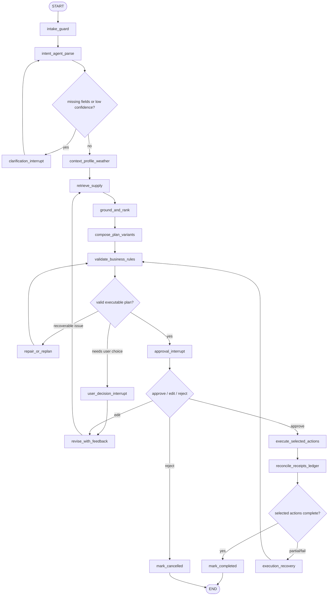

# LangGraph Business Redesign Design

## Goal

Redesign the WeekendPilot backend from a mostly linear planning pipeline into a durable, non-linear business workflow that can clarify, validate, pause for approval, execute selected side effects, recover from failures, and preserve an auditable history.

The redesign keeps LangGraph as the workflow orchestrator, but changes the meaning of the graph: LangGraph should own the business state transitions, not just the initial plan-building sequence.

## Current Problems

The current graph is effectively:

```text
parse_intent -> build_context -> search_candidates -> rank_candidates -> build_itinerary -> validate_plan -> prepare_confirmation
```

That shape is too linear for the actual product. The current backend allows invalid plans to reach confirmation, treats confirmation as a direct API state mutation, stores execution ledgers in memory, overwrites receipts during partial execution, allows completed plans to be recovered in place, and does not use LangGraph checkpointing or interrupts for human approval.

The highest-risk business bugs are:

- Validation failures can still produce pending actions and can be confirmed by API calls.
- Confirmation and execution are outside the graph, so they bypass the workflow state machine.
- Side-effect ledger state is not durable across process restarts.
- Partial execution mutates `pending_actions` into a subset and loses earlier receipts.
- Recovery mutates completed plans while keeping stale receipts from the old plan.
- SSE stream reconnect can trigger duplicate builds because build identity is not durable.
- `required_actions` from intent parsing does not actually constrain generated actions.
- Availability, route, date, and action-time validation are not strong enough for execution.

## Design Principles

1. LangGraph is the state machine, not a convenience wrapper around planning.
2. Human approval is a graph interrupt, not a separate boolean endpoint.
3. Plans are versioned. Executed revisions are immutable.
4. Side effects are ledger entries. Receipts are append-only facts.
5. LLMs propose intent and options; deterministic policy gates execution.
6. Recovery creates a new validated revision or action retry, not silent mutation.
7. The backend protocol is the source of truth. The frontend must adapt to the backend workflow contract, not the other way around.

## Recommended Architecture

Use a deterministic StateGraph with specialist agent nodes. Do not use a fully autonomous multi-agent swarm. The product is a local-life planning and execution workflow with reservations, orders, messages, and calendar side effects; it needs strong control boundaries.

Recommended shape:



## Agent Model

Use specialist nodes rather than free-form agent handoffs.

### Intent Agent

Responsibilities:

- Parse the user's goal into structured constraints.
- Identify missing fields and confidence.
- Suggest candidate action intent, but not final executable actions.

Non-responsibilities:

- It must not decide that a reservation/order/message will definitely execute.
- It must not silently fill high-risk fields such as party size, date, or payment-like actions when confidence is low.

### Supply Agent

Responsibilities:

- Retrieve POIs, restaurants, coupons, menu hints, availability, weather, and route candidates.
- Attach provenance, freshness, source confidence, and rejection reasons.

Non-responsibilities:

- It must not create itinerary steps or side-effect actions.

### Planner Agent

Responsibilities:

- Compose itinerary variants from grounded candidates.
- Preserve the user's constraints and explicitly explain tradeoffs.
- Keep each variant internally consistent.

Non-responsibilities:

- It must not mark a plan executable.
- It must not perform recovery after execution failure.

### Validator Agent

Responsibilities:

- Enforce deterministic business rules.
- Check route feasibility, opening day/time, availability slot match, party capacity, weather mismatch, budget, action eligibility, and action-time consistency.
- Decide whether a plan can reach approval.

This node should be mostly deterministic Python. LLM assistance can explain issues, but not override the rule result.

### Recovery Agent

Responsibilities:

- Repair invalid plans before approval.
- Create a new revision when the user edits feedback.
- Recover from execution failure by retrying an action, replacing a node, or generating a new version.

Non-responsibilities:

- It must not mutate a completed revision in place.

## State Schema

Introduce a graph-owned state that is richer than the current `PlanState.status` string.

```python
class PlanGraphState(TypedDict, total=False):
    thread_id: str
    run_id: str
    plan_id: str
    revision_id: str
    user_id: str
    phase: Literal[
        "draft",
        "needs_clarification",
        "planning",
        "validation_failed",
        "pending_approval",
        "approved",
        "executing",
        "partially_completed",
        "completed",
        "cancelled",
        "failed",
    ]
    goal: str
    constraints: dict[str, Any]
    profile_snapshot: dict[str, Any]
    context: dict[str, Any]
    candidates: dict[str, list[dict[str, Any]]]
    candidate_sets: dict[str, list[dict[str, Any]]]
    rejected_candidates: dict[str, list[dict[str, Any]]]
    variants: list[dict[str, Any]]
    selected_variant_id: str | None
    validation: dict[str, Any]
    pending_decision: dict[str, Any] | None
    actions: list[dict[str, Any]]
    action_ledger: dict[str, Any]
    receipts: list[dict[str, Any]]
    recovery_history: list[dict[str, Any]]
    trace: list[dict[str, Any]]
```

## Plan Versioning

Use two identities:

- `plan_id`: the user-visible plan group.
- `revision_id`: one concrete immutable plan version.

Rules:

- Every new plan group creates revision 1.
- Every user feedback change creates a new revision.
- Every recovery that changes itinerary, route, candidate, or action set creates a new revision.
- Once any side-effect action succeeds for a revision, that revision's itinerary and actions are immutable.
- Completed revisions cannot be recovered in place.
- A completed plan can spawn a new revision, but old receipts stay attached to the old revision.

## Business State Transitions

Allowed transitions:

```text
draft -> needs_clarification
draft -> planning
needs_clarification -> planning
planning -> validation_failed
planning -> pending_approval
validation_failed -> planning
validation_failed -> needs_clarification
pending_approval -> approved
pending_approval -> planning
pending_approval -> cancelled
approved -> executing
executing -> completed
executing -> partially_completed
executing -> failed
partially_completed -> executing
partially_completed -> planning
failed -> planning
```

Forbidden transitions:

- `validation_failed -> approved`
- `validation_failed -> executing`
- `completed -> pending_approval` on the same revision
- `completed -> executing` unless there are explicit retryable failed actions
- `cancelled -> executing`

## Validation Rules

The plan can enter approval only if all blocking validations pass.

Blocking validations:

- Required time/date fields are known.
- Party size is known and positive.
- Each non-transport itinerary step has a grounded POI.
- Each POI is open on the requested day and time.
- Restaurant availability slot matches the itinerary time, or the itinerary is updated to the available slot.
- Party capacity is sufficient.
- Weather-sensitive outdoor plans are not marked executable during rain without explicit user approval.
- Route includes origin-to-first-stop and all inter-stop legs.
- Route plus activity duration fits the time window.
- Budget limit is enforced according to budget level.
- Actions are allowed by user intent and policy.
- Action payload times match itinerary times.
- Side-effect actions have idempotency keys before approval.

Warnings can reach approval only if included in the interrupt payload. Examples: mild queue risk, low source confidence, flexible time shift.

## Action Policy

LLM output may suggest actions, but a deterministic policy builds the final action set.

Action rules:

- `activity_reservation` only when the POI supports booking and the user asked for booking/reservation, or when the selected activity requires booking.
- `restaurant_reservation` only when the itinerary includes a restaurant and the user intent includes dining or the duration implies a meal with explicit confirmation.
- `claim_coupon` only when a concrete coupon exists and the user opts into commercial actions.
- `create_order` only when a menu payload exists and the user opts into ordering.
- `send_plan_message` only when the user has specified or accepted a recipient.
- `create_calendar_event` only when the user accepts calendar side effects.

Every action must include:

```python
{
    "action_id": "act_01JZ7A8Q4R2M9N0P3V6X5Y1K2H",
    "revision_id": "rev_01JZ7A8N7S6K2P4R9T0V3W5X1Y",
    "tool": "create_reservation",
    "status": "pending",
    "idempotency_key": "rev_01JZ7A8N7S6K2P4R9T0V3W5X1Y:act_01JZ7A8Q4R2M9N0P3V6X5Y1K2H",
    "requires_confirmation": True,
    "payload": {"place_id": "poi_019", "time": "15:45", "party_size": 4},
    "attempts": [],
    "receipt_id": "",
}
```

## Execution Ledger

The ledger is the source of truth for side effects.

Rules:

- Ledger state is persisted, not reconstructed from `pending_actions`.
- Executing a selected action appends an attempt record.
- Receipts are append-only.
- A partial execution keeps successful receipts and leaves unselected actions pending.
- Retrying a failed action reuses the same action id and a new attempt id.
- Re-running the same idempotency key returns the existing receipt instead of calling the tool again.
- Unknown action ids return a validation error.

## Human Interrupts

Use LangGraph `interrupt()` for clarification, approval, and user repair decisions.

Interrupt payloads must be JSON-serializable and UI-ready:

```python
{
    "type": "approval_required",
    "plan_id": "plan_01JZ7A8K8T5Y3M4N2P9Q0R6S1V",
    "revision_id": "rev_01JZ7A8N7S6K2P4R9T0V3W5X1Y",
    "title": "朋友活动 + 顺路聚餐计划",
    "summary": "活动和聚餐连在一起，控制总时长和路线绕行。",
    "warnings": [{"code": "queue_risk", "message": "餐厅周末可能排队，建议保留订座动作。"}],
    "actions": [{"action_id": "act_01JZ7A8Q4R2M9N0P3V6X5Y1K2H", "tool": "create_reservation", "label": "预订餐厅"}],
    "allowed_decisions": ["approve", "edit", "reject"],
}
```

Resume payload:

```python
{
    "decision": "approve",
    "selected_action_ids": ["act_1", "act_2"],
    "edited_constraints": {},
    "feedback_text": "",
}
```

## API Design

Replace one-off build and direct confirmation endpoints with run/thread APIs.

This API can be a breaking change. Do not preserve old frontend-driven endpoint semantics if they conflict with the graph state machine. The only compatibility requirement is that every externally visible state transition is explicit, durable, and enforceable by the backend.

```text
POST /api/plans/runs
GET  /api/plans/runs/{run_id}/stream
GET  /api/plans/{plan_id}
GET  /api/plans/{plan_id}/versions
POST /api/plans/{plan_id}/resume
POST /api/plans/{plan_id}/actions/{action_id}/retry
GET  /api/traces/{plan_id}
```

`POST /api/plans/runs` starts a graph run:

```json
{
  "goal": "今天下午朋友4个人出去玩，先活动再吃饭",
  "user_id": "local_demo_user"
}
```

Response:

```json
{
  "run_id": "run_01JZ7A8J4M6S2V9R3K5T0P1N7Q",
  "thread_id": "thread_01JZ7A8H2Q9N4R6T1V5M0P3K8S",
  "plan_id": "plan_01JZ7A8K8T5Y3M4N2P9Q0R6S1V"
}
```

`GET /api/plans/runs/{run_id}/stream` streams graph updates. Events must include stable event ids so clients can resume after disconnect:

```text
id: evt_000001
event: graph_update
data: {"node":"retrieve_supply","phase":"planning"}
```

## Persistence

Use a durable LangGraph checkpointer with `thread_id`.

Persistence layers:

- LangGraph checkpoint store for resumable graph state.
- Relational tables for plan summaries, revisions, action ledger, receipts, and trace events.
- JSON columns for structured state snapshots where a full relational model is unnecessary.

Do not use pickle for persistent business state. Python's pickle format is not safe for untrusted data and is poor for schema migration.

## Suggested Storage Tables

```text
plan_threads(thread_id, plan_id, user_id, status, created_at, updated_at)
plan_revisions(revision_id, plan_id, version, phase, goal, constraints_json, plan_json, validation_json, created_at)
action_ledger(action_id, revision_id, tool, status, idempotency_key, payload_json, receipt_id, created_at, updated_at)
action_attempts(attempt_id, action_id, status, request_json, response_json, error, created_at)
receipts(receipt_id, action_id, revision_id, tool, status, detail, payload_json, created_at)
trace_events(event_id, thread_id, revision_id, node, kind, status, input_json, output_json, created_at)
```

## External Contract

The backend exposes a graph-run protocol. Any client, including the current frontend, must treat this protocol as authoritative.

Contract rules:

- Clients do not set plan status directly.
- Clients do not call separate confirm and execute endpoints.
- Clients resume graph interrupts with decisions.
- Clients may request selected action ids, but the backend validates them against the current revision ledger.
- Clients may request edits, but the backend decides whether the result is a new revision, a validation failure, or a new approval interrupt.
- Clients display backend phases, validation results, action ledger entries, and receipts without inventing extra business state.

This spec does not require compatibility with the current frontend state machine. If the current frontend cannot represent graph interrupts, revisions, or ledger-backed partial execution, it should be rewritten against this contract after the backend is implemented.

## Testing Strategy

Add invariant tests before implementation.

Backend tests:

- A validation-failed plan cannot be confirmed or executed.
- A recovering plan has no executable pending actions until repaired and revalidated.
- Partial execution preserves previous receipts and leaves unselected actions pending.
- Service restart does not duplicate successful side effects.
- Reusing the same idempotency key returns the original receipt.
- Unknown action ids fail with validation error.
- Completed revisions cannot be mutated by recovery.
- Recovery after completion creates a new revision.
- Availability alternate slot must update itinerary or block approval.
- Origin-to-first-stop travel is included in route validation.
- Clarification responses are not listed as saved executable plans.

Contract tests:

- Plan response includes plan id, revision id, phase, validation summary, actions, ledger, receipts, and interrupt state.
- Action ids are stable and opaque.
- Receipt ids are stable across process restarts.
- Resume payloads are validated against the current interrupt type.
- Run streams expose stable event ids and do not create new plans on reconnect.
- Old direct confirm/execute semantics are not part of the new contract.

## Migration Plan

Implement in stages:

1. Introduce graph state schema and deterministic state transition helpers.
2. Persist action ledger and receipts separately from `PlanState`.
3. Enforce status gates for confirm, execute, recover, and revise.
4. Move confirmation into a graph interrupt.
5. Replace one-off SSE build with run/thread streaming.
6. Add revision model and make executed revisions immutable.
7. Strengthen validation rules.
8. Split the current large pipeline into focused nodes/modules.
9. Remove or hard-disable old direct confirmation and execution endpoints once the graph-run API is available.

## Non-Goals

- Do not integrate live booking or payment providers in this redesign.
- Do not introduce a fully autonomous multi-agent supervisor.
- Do not preserve the current frontend API contract.
- Do not preserve pickle repository compatibility beyond a temporary migration script if needed.

## References

- LangGraph Persistence: https://docs.langchain.com/oss/python/langgraph/persistence
- LangGraph Durable Execution: https://docs.langchain.com/oss/python/langgraph/durable-execution
- LangGraph Interrupts / Human-in-the-loop: https://docs.langchain.com/oss/python/langgraph/human-in-the-loop
- LangChain Multi-agent Handoffs: https://docs.langchain.com/oss/python/langchain/multi-agent/handoffs
- MDN Server-sent events: https://developer.mozilla.org/en-US/docs/Web/API/Server-sent_events/Using_server-sent_events
- Python pickle security warning: https://docs.python.org/3/library/pickle.html
